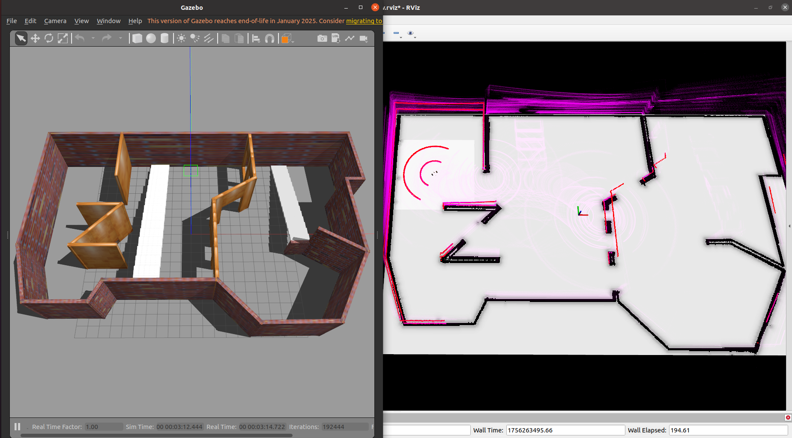

# 前言
## 1. 项目介绍
本项目围绕**激光雷达（LiDAR）与IMU多传感器融合的机器人自主定位与导航**展开，具体功能模块如下：
- **核心定位**：基于 Fast-LIO2 实现激光-惯性融合定位，提供高频、稳定的实时位姿；
- **路径规划与导航**：采用 move_base 作为导航框架，完成全局路径规划与局部避障；
- **重定位方案**：支持多算法可选——hdl_localization（激光点云全局重定位）、RTAB-Map（视觉/激光融合重定位）、ORB-SLAM3（视觉特征重定位）；
- **辅助工具**：集成 PointCloud Downsample 包（点云体素下采样，降低算力消耗）、pcd2pgm 包（3D PCD 点云转 2D PGM 栅格地图，适配导航需求）。

### 效果演示
- **仿真测试**  
<div align="center"></div>
<div align="center">simulation</div>
<br>

- **实车验证**  
<div align="center"></div>
<div align="center">Real world video（看不清可以看doc/Real_world_video.mp4）</div>
<br>

## 2. 开发与运行环境
| 类别       | 具体配置                  | 说明                          |
|------------|---------------------------|-------------------------------|
| 操作系统   | Ubuntu 20.04 LTS          | 兼容 ROS Noetic 的推荐系统版本 |
| ROS 版本  | ROS Noetic                | 项目依赖的核心框架版本        |
| 激光雷达   | Mid360 / Velodyne VLP-16  | LIDAR  |

## 3. 相关引用
- [fast-lio2](https://github.com/hku-mars/FAST_LIO)
- [hdl_localization](https://github.com/koide3/hdl_localization)
- [ORB_SLAM3_ROS](https://github.com/emanuelenencioni/ORB_SLAM3_ROS.git)
- [RTAB-Map](https://introlab.github.io/rtabmap/)
- [Livox_sdk2](https://github.com/Livox-SDK/Livox-SDK2)
- [livox_ros_driver2](https://github.com/Livox-SDK/livox_ros_driver2)
- [livox ros driver2安装博客](https://blog.csdn.net/qq_29912325/article/details/130269367?ops_request_misc=%257B%2522request%255Fid%2522%253A%2522169734904416800182711632%2522%252C%2522scm%2522%253A%252220140713.130102334..%2522%257D&request_id=169734904416800182711632&biz_id=0&utm_medium=distribute.pc_search_result.none-task-blog-2~all~sobaiduend~default-2-130269367-null-null.142^v96^pc_search_result_base9&utm_term=livox_sdk2&spm=1018.2226.3001.4187)
- [MID360 offical web官网](https://www.livoxtech.com/cn/mid-360)
- [Quick-start-doc|MID360快速开始手册](https://terra-1-g.djicdn.com/65c028cd298f4669a7f0e40e50ba1131/Mid360/Livox_Mid-360_Quick_Start_Guide_multi.pdf)
- [user-manual|MID360用户手册](https://terra-1-g.djicdn.com/65c028cd298f4669a7f0e40e50ba1131/Mid360/20230727/Livox_Mid-360_User_Manual_CHS.pdf)
- [NEXTE_Sentry_Nav](https://github.com/66Lau/NEXTE_Sentry_Nav/tree/main)

# 创建ROS工作空间
## 1. 创建工作空间目录
首先，打开终端并创建一个新的ROS工作空间目录。以下是创建名为 `catkin_ws` 的工作空间的示例：
```bash
mkdir -p ~/catkin_ws/src
cd ~/catkin_ws/src
```

## 2. 初始化工作空间
在 `src` 目录下，使用 `catkin_init_workspace` 命令初始化工作空间：
```bash
catkin_init_workspace
```

## 3. 复制功能包到 `src` 目录
```bash
git clone https://e.coding.net/future-vision/ros_nav/fastlio2_relocate.git
```

# 安装和编译特定功能包
## 1. 安装Livox-SDK2
```bash
cd ~/catkin_ws/src/Livox-SDK2/
mkdir build
cd build
cmake .. && make -j
sudo make install
```

## 2. 编译livox_ros_driver2
```bash
cd ~/catkin_ws/src/livox_ros_driver2
source /opt/ros/noetic/setup.sh
./build.sh ROS1
```
如果编译livox_ros_driver2时，执行sh脚本有时报错找不到Pose6D.h和CustomMsg.h（即便添加依赖也不行）预测是编译顺序问题，删掉devel和build目录多编译几次，或者直接在工作空间下catkin_make也行

# 构建工作空间
## 1. 编译工作空间
返回工作空间根目录，使用 `catkin_make` 命令编译工作空间：
```bash
cd ~/catkin_ws
catkin_make
```

## 2. 环境变量设置
每次打开新的终端时，需要设置ROS环境变量，以便系统能够找到编译好的功能包。可以通过以下命令设置：
```bash
source ./devel/setup.bash
```
为了避免每次都手动设置，可以将该命令添加到 `~/.bashrc` 文件中：
```bash
echo "source ~/${catkin_ws}/devel/setup.bash" >> ~/.bashrc
source ~/.bashrc
```

# 如何导航
## 1. 修改 `car_model/urdf/sensor_laser.urdf.xacro` 文件
在运行仿真时，需要修改 `car_model/urdf/sensor_laser.urdf.xacro` 文件中第34行和第74行的 `.so` 文件的绝对路径，将其修改为你自己编译文件的位置：
```xml
<plugin name="gazebo_ros_laser_controller" filename="/home/generic/fastlio2_relocate/devel/lib/libgazebo_ros_velodyne_gpu_laser.so">
<plugin name="gazebo_ros_laser_controller" filename="/home/generic/fastlio2_relocate/devel/lib/libgazebo_ros_velodyne_laser.so">
```

## 2. `nav_gazebo_diff.launch` 文件介绍与用法
### 功能概述
此launch文件用于在Gazebo仿真环境中启动差速驱动机器人的导航系统，同样集成了机器人模型、导航功能、定位算法、地图发布、TF转换和RViz可视化等组件。

### 使用方法
在终端中输入以下命令启动该launch文件：
```bash
roslaunch nav nav_gazebo_diff.launch
```
其中为避免导航过程中空间溢出，pcd_save_en默认为false，可按需求自行修改。
另外，可通过修改src/slam/FAST_LIO/config/velodyne.yaml或其他yaml文件中`min_angle_deg`、`max_angle_deg`、`retain_above_horizon`(是否保留裁切区域的z>0部分)等参数修改点云范围
若要指定不同的定位算法，可以使用以下命令：
```bash
roslaunch nav nav_gazebo_diff.launch algorithm:=1
```

## 3. `nav_gazebo_ackman.launch` 文件介绍与用法
### 功能概述
此launch文件用于在Gazebo仿真环境中启动阿克曼转向机器人的导航系统，集成了机器人模型、导航功能、定位算法、地图发布、TF转换和RViz可视化等组件。

### 使用方法
在终端中输入以下命令启动该launch文件：
```bash
roslaunch nav nav_gazebo_ackman.launch
```
若要指定不同的定位算法，可以使用以下命令：
```bash
roslaunch nav nav_gazebo_ackman.launch algorithm:=0
```

# 重定位算法及相关思路（这部分仅验证了可行性，待整合至导航系统）
重定位是机器人在未知环境或已建图环境中，通过传感器数据恢复或初始化自身位置的关键功能。


## 1. hdl_localization（基于点云的全局重定位）
### 1.1 核心功能
- 基于3D点云匹配实现全局重定位，依赖激光雷达（LiDAR）数据， 一种基于NDT点云配准的算法；
- 支持将预构建的全局点云地图作为参考，实时匹配机器人当前激光点云，输出全局位姿；

### 1.2 部署与使用方法
1. **源码部署**：参考官方仓库[hdl_localization](https://github.com/koide3/hdl_localization)的README文档；
2. **地图替换**：将仓库默认的全局地图替换为**自定义场景的点云地图**（格式`.pcd`）；
3. **算力优化**：若硬件算力不足，可利用`PointCloud Downsample`做轻量化处理；


## 2. RTAB-Map（基于视觉-惯性/激光的实时重定位）
### 2.1 核心功能
- 融合视觉（RGB/D相机）、激光数据，构建稠密地图并实现实时重定位；
- 支持闭环检测与地图优化，重定位精度较高，同时提供地图可视化与数据库存储功能；

### 2.2 部署与使用方法
#### 2.2.1 快速安装（ROS环境）
通过APT包管理器直接安装，无需源码编译（以ROS Noetic为例）：
```bash
# 替换[版本号]为实际ROS版本（如noetic、melodic）
sudo apt-get install -y ros-[版本号]-rtabmap ros-[版本号]-rtabmap-ros
```

#### 2.2.2 启动与配置
1. **参数修改**：进入自定义导航功能包（如`nav`）的`launch`目录，编辑`rtabmap.launch`：
   - 替换话题名称：将默认的传感器话题（如相机`/camera/rgb/image_raw`、激光`/scan`）改为**机器人实际发布的话题**；
   - 是否进行重定位：通过`database_path`参数设置建图输出路径，设置`localization`为true时加载`database_path`处预先构建地图，为false时在程序启动时会提前删除路径处地图并重新构建；
   - 冗余功能注释：若无需地图保存、闭环检测等功能，可注释对应节点（如`rtabmap_save`）以减少资源占用；
2. **启动重定位**：
   ```bash
   roslaunch nav rtabmap.launch
   ```
3. **测试验证**：
   - 仿真测试：直接在Gazebo等仿真环境中启动，观察RViz中重定位位姿是否跟随机器人运动；
   - 数据集测试：使用[ETH KITTI/MAV视觉惯性数据集](https://projects.asl.ethz.ch/datasets/doku.php?id=kmavvisualinertialdatasets#downloads)，修改`launch`文件中话题映射，验证算法在真实数据下的表现。

4. **查看建图**：
   ```bash
   rtabmap-databaseViewer ~/.ros/rtabmap.db
   ```

#### 2.2.3 参考资料
- RTAB-Map参数详解：[RTAB-Map ROS参数配置指南](https://blog.csdn.net/m0_62979274/article/details/150866519?spm=1001.2014.3001.5502)

### 2.3 效果演示
<div align="center"></div>
<div align="center">RTAB-Map simulation（看不清可以看doc/RTAB-Map_simulation.mp4）</div>
<br>

## 3. ORB-SLAM3/VINS（基于ORB特征的视觉重定位）
### 3.1 ORB-SLAM3核心功能
- 发布关键话题：
  - `/orb_slam3/map`（PointCloud2）：全局地图点云；
  - `/orb_slam3/camera_pose`（PoseStamped）：左目相机在世界坐标系下的实时位姿（重定位结果）；
  - `/orb_slam3/odom`（Odometry）：视觉里程计数据；
  - `/tf`：相机坐标系到世界坐标系的坐标变换；
- 支持单目、双目、RGB-D等多种相机输入，适配不同硬件场景。

### 3.2 可行性验证
1. **测试环境**：
   - 算法包：`ORB_SLAM3_ROS`；
   - 数据集：[ETH MAV视觉惯性数据集（MH_01序列）](https://projects.asl.ethz.ch/datasets/doku.php?id=kmavvisualinertialdatasets#downloads)；
   - 启动脚本：使用包内`tum_rgbd.launch`，修改话题名称以匹配数据集格式；
2. **启动重定位**：
   ```bash
   roslaunch orb_slam3_ros tum_rgbd.launch
   ```
3. **验证结果**：重定位精度满足基础需求，位姿跟踪稳定（如下图所示）。

<div align="center"></div>
<div align="center">orb-slam3-ros</div>
<br>


### 3.3 局限性说明
根据技术调研反馈，ORB-SLAM3、VINS等基于ORB特征的算法存在明显局限性：
- **环境依赖性强**：对光照变化（如强光/阴影）、纹理缺失（如白墙）、动态目标敏感，易出现特征匹配失败，导致重定位丢失；
- **鲁棒性不足**：在复杂场景（如室内走廊、室外动态人群）中，重定位稳定性弱于激光雷达或多传感器融合方案；
- 基于以上问题，暂未继续深入调研该类算法的工程化整合。


# 其他功能包使用说明
## 1. PointCloud Downsample 包使用
### 功能
该包是一个ROS节点，用于PCD点云文件的轻量化（体素网格下采样）。

### 核心接口配置
在 `launch/downsample.launch` 文件中，需要配置以下参数：
- `input_pcd`：输入PCD文件路径
- `output_pcd`：输出文件保存路径
- `leaf_size_x/y/z`：体素大小，体素越大，点数越少，细节损失越多（单位：米，推荐0.1 - 0.3）

### 使用方法
```bash
roslaunch pointcloud_downsample downsample.launch
```

## 2. pcd2pgm 包（pcd2pgm_xyz 节点）使用
### 功能
ROS节点，实现3D PCD点云转2D PGM地图，支持半径滤波去离群点。

### 核心接口配置
在 `launch/run_xyz.launch` 文件中，需配置以下参数：
- `file_directory`：PCD文件存放目录
- `file_name`：PCD文件名（无后缀）及PGM输出基础名
- `projection_plane`：点云投影平面（示例"xy"）
- `filter_radius`：半径滤波搜索半径（米，示例0.1）
- `min_neighbors`：滤波最小邻居数（示例3）

### 使用方法
```bash
roslaunch pcd2pgm run_xyz.launch
```

## 3. 通过键盘发送 `/cmd_vel`
```bash
sudo apt install ros-noetic-teleop-twist-keyboard
rosrun teleop_twist_keyboard teleop_twist_keyboard.py
```