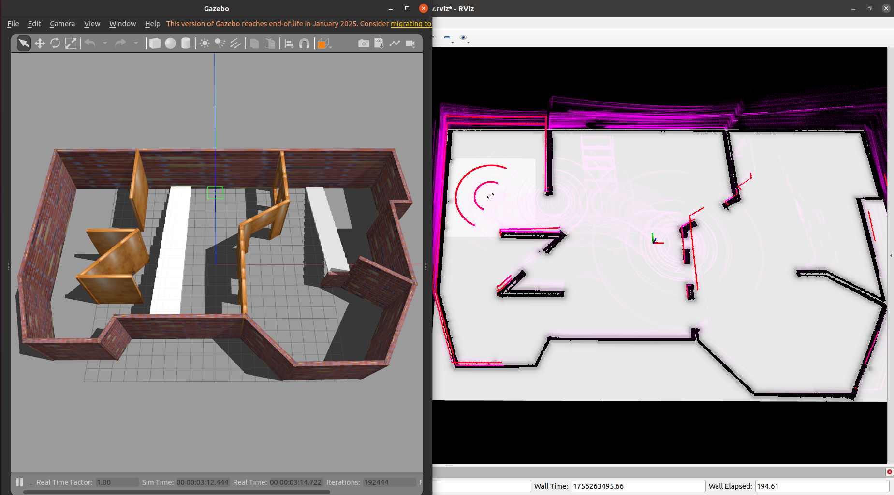
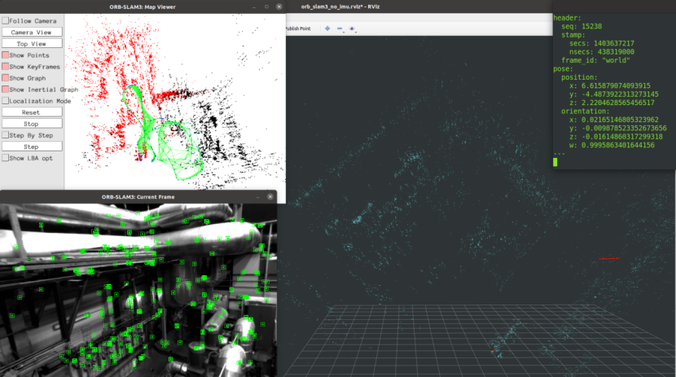

# Preface
## 1. Project Introduction
This project focuses on **robot autonomous positioning and navigation through LiDAR and IMU multi-sensor fusion**, with the following specific functional modules:
- **Core Positioning**: Implement laser-inertial fusion positioning based on Fast-LIO2 to provide high-frequency and stable real-time poses;
- **Path Planning and Navigation**: Adopt move_base as the navigation framework to complete global path planning and local obstacle avoidance;
- **Relocalization Solutions**: Support multiple optional algorithms - hdl_localization (laser point cloud global relocalization), RTAB-Map (visual/laser fusion relocalization), ORB-SLAM3 (visual feature relocalization);
- **Auxiliary Tools**: Integrate the PointCloud Downsample package (point cloud voxel downsampling to reduce computational consumption) and the pcd2pgm package (3D PCD point cloud to 2D PGM grid map, adapted to navigation needs).

### Effect Demonstration
- **Simulation Test**  
<div align="center"></div>
<div align="center">simulation</div>
<br>

- **Real Vehicle Verification**  
<div align="center"></div>
<div align="center">Real world video(or Real_world_video.mp4)</div>
<br>

## 2. Development and Operating Environment
| Category       | Specific Configuration     | Description                                  |
|----------------|----------------------------|----------------------------------------------|
| Operating System | Ubuntu 20.04 LTS           | Recommended system version compatible with ROS Noetic |
| ROS Version    | ROS Noetic                 | Core framework version relied on by the project |
| LiDAR          | Mid360 / Velodyne VLP-16   | LIDAR                                         |

## 3. Related References
- [fast-lio2](https://github.com/hku-mars/FAST_LIO)
- [hdl_localization](https://github.com/koide3/hdl_localization)
- [ORB_SLAM3_ROS](https://github.com/emanuelenencioni/ORB_SLAM3_ROS.git)
- [RTAB-Map](https://introlab.github.io/rtabmap/)
- [Livox_sdk2](https://github.com/Livox-SDK/Livox-SDK2)
- [livox_ros_driver2](https://github.com/Livox-SDK/livox_ros_driver2)
- [Blog on installing livox ros driver2](https://blog.csdn.net/qq_29912325/article/details/130269367?ops_request_misc=%257B%2522request%255Fid%2522%253A%2522169734904416800182711632%2522%252C%2522scm%2522%253A%252220140713.130102334..%2522%257D&request_id=169734904416800182711632&biz_id=0&utm_medium=distribute.pc_search_result.none-task-blog-2~all~sobaiduend~default-2-130269367-null-null.142^v96^pc_search_result_base9&utm_term=livox_sdk2&spm=1018.2226.3001.4187)
- [MID360 official website](https://www.livoxtech.com/cn/mid-360)
- [Quick-start-doc|MID360 Quick Start Guide](https://terra-1-g.djicdn.com/65c028cd298f4669a7f0e40e50ba1131/Mid360/Livox_Mid-360_Quick_Start_Guide_multi.pdf)
- [user-manual|MID360 User Manual](https://terra-1-g.djicdn.com/65c028cd298f4669a7f0e40e50ba1131/Mid360/20230727/Livox_Mid-360_User_Manual_CHS.pdf)
- [NEXTE_Sentry_Nav](https://github.com/66Lau/NEXTE_Sentry_Nav/tree/main)

# Create a ROS Workspace
## 1. Create Workspace Directory
First, open the terminal and create a new ROS workspace directory. Here is an example of creating a workspace named `catkin_ws`:
```bash
mkdir -p ~/catkin_ws/src
cd ~/catkin_ws/src
```

## 2. Initialize the Workspace
In the `src` directory, use the `catkin_init_workspace` command to initialize the workspace:
```bash
catkin_init_workspace
```

## 3. Copy Packages to the `src` Directory
```bash
git clone https://e.coding.net/future-vision/ros_nav/fastlio2_relocate.git
```

# Install and Compile Specific Packages
## 1. Install Livox-SDK2
```bash
cd ~/catkin_ws/src/Livox-SDK2/
mkdir build
cd build
cmake .. && make -j
sudo make install
```

## 2. Compile livox_ros_driver2
```bash
cd ~/catkin_ws/src/livox_ros_driver2
source /opt/ros/noetic/setup.sh
./build.sh ROS1
```
When compiling livox_ros_driver2, sometimes the execution of the sh script reports an error that Pose6D.h and CustomMsg.h cannot be found (even after adding dependencies). It is predicted that this is a compilation order issue. Delete the devel and build directories and compile several times, or directly use catkin_make in the workspace.

# Build the Workspace
## 1. Compile the Workspace
Return to the root directory of the workspace and use the `catkin_make` command to compile the workspace:
```bash
cd ~/catkin_ws
catkin_make
```

## 2. Environment Variable Setting
Each time you open a new terminal, you need to set the ROS environment variables so that the system can find the compiled packages. You can set them with the following command:
```bash
source ./devel/setup.bash
```
To avoid manually setting this every time, you can add this command to the `~/.bashrc` file:
```bash
echo "source ~/${catkin_ws}/devel/setup.bash" >> ~/.bashrc
source ~/.bashrc
```

# How to Navigate
## 1. Modify the `car_model/urdf/sensor_laser.urdf.xacro` File
When running the simulation, you need to modify the absolute paths of the `.so` files in lines 34 and 74 of the `car_model/urdf/sensor_laser.urdf.xacro` file to the location of your own compiled files:
```xml
<plugin name="gazebo_ros_laser_controller" filename="/home/generic/fastlio2_relocate/devel/lib/libgazebo_ros_velodyne_gpu_laser.so">
<plugin name="gazebo_ros_laser_controller" filename="/home/generic/fastlio2_relocate/devel/lib/libgazebo_ros_velodyne_laser.so">
```

## 2. Introduction and Usage of the `nav_gazebo_diff.launch` File
### Function Overview
This launch file is used to start the navigation system of a differential drive robot in the Gazebo simulation environment. It also integrates components such as the robot model, navigation functions, positioning algorithms, map publishing, TF transformation, and RViz visualization.

### Usage Method
Enter the following command in the terminal to start the launch file:
```bash
roslaunch nav nav_gazebo_diff.launch
```
To avoid space overflow during navigation, pcd_save_en is false by default, and you can modify it as needed.
In addition, you can modify parameters such as `min_angle_deg`, `max_angle_deg`, and `retain_above_horizon` (whether to retain the z>0 part of the cropped area) in src/slam/FAST_LIO/config/velodyne.yaml or other yaml files to change the point cloud range.
To specify a different positioning algorithm, you can use the following command:
```bash
roslaunch nav nav_gazebo_diff.launch algorithm:=1
```

## 3. Introduction and Usage of the `nav_gazebo_ackman.launch` File
### Function Overview
This launch file is used to start the navigation system of an Ackermann steering robot in the Gazebo simulation environment. It integrates components such as the robot model, navigation functions, positioning algorithms, map publishing, TF transformation, and RViz visualization.

### Usage Method
Enter the following command in the terminal to start the launch file:
```bash
roslaunch nav nav_gazebo_ackman.launch
```
To specify a different positioning algorithm, you can use the following command:
```bash
roslaunch nav nav_gazebo_ackman.launch algorithm:=0
```

# Relocalization Algorithms and Related Ideas (This part only verifies feasibility and is to be integrated into the navigation system)
Relocalization is a key function for robots to recover or initialize their own positions in unknown environments or mapped environments through sensor data.


## 1. hdl_localization (Global Relocalization Based on Point Cloud)
### 1.1 Core Functions
- Realize global relocalization based on 3D point cloud matching, relying on LiDAR data, an algorithm based on NDT point cloud registration;
- Support using a pre-built global point cloud map as a reference, real-time matching of the robot's current laser point cloud, and output global pose;

### 1.2 Deployment and Usage Methods
1. **Source Code Deployment**: Refer to the README document of the official repository [hdl_localization](https://github.com/koide3/hdl_localization);
2. **Map Replacement**: Replace the default global map of the repository with a **custom scene point cloud map** (format `.pcd`);
3. **Computational Power Optimization**: If the hardware computing power is insufficient, `PointCloud Downsample` can be used for lightweight processing;


## 2. RTAB-Map (Real-Time Relocalization Based on Vision-Inertial/Laser)
### 2.1 Core Functions
- Fuse vision (RGB/D camera) and laser data to build dense maps and realize real-time relocalization;
- Support loop closure detection and map optimization, with high relocalization accuracy, and provide map visualization and database storage functions;

### 2.2 Deployment and Usage Methods
#### 2.2.1 Quick Installation (ROS Environment)
Install directly through the APT package manager without source code compilation (taking ROS Noetic as an example):
```bash
# Replace [version] with the actual ROS version (e.g., noetic, melodic)
sudo apt-get install -y ros-[version]-rtabmap ros-[version]-rtabmap-ros
```

#### 2.2.2 Startup and Configuration
1. **Parameter Modification**: Enter the `launch` directory of the custom navigation package (such as `nav`) and edit `rtabmap.launch`:
   - Replace topic names: Change the default sensor topics (such as camera `/camera/rgb/image_raw`, laser `/scan`) to the **topics actually published by the robot**;
   - Whether to perform relocalization: Set the map output path through the `database_path` parameter. When `localization` is set to true, the pre-built map at `database_path` is loaded; when it is false, the map at the path will be deleted in advance and rebuilt when the program starts;
   - Comment out redundant functions: If functions such as map saving and loop closure detection are not needed, the corresponding nodes (such as `rtabmap_save`) can be commented out to reduce resource usage;
2. **Start Relocalization**:
   ```bash
   roslaunch nav rtabmap.launch
   ```
3. **Test Verification**:
   - Simulation test: Start directly in a simulation environment such as Gazebo and observe whether the relocalization pose in RViz follows the robot's movement;
   - Dataset test: Use the [ETH KITTI/MAV visual-inertial dataset](https://projects.asl.ethz.ch/datasets/doku.php?id=kmavvisualinertialdatasets#downloads), modify the topic mapping in the `launch` file, and verify the performance of the algorithm on real data.

4. **View the Built Map**:
   ```bash
   rtabmap-databaseViewer ~/.ros/rtabmap.db
   ```

#### 2.2.3 Reference Materials
- Detailed explanation of RTAB-Map parameters: [RTAB-Map ROS Parameter Configuration Guide](https://blog.csdn.net/m0_62979274/article/details/150866519?spm=1001.2014.3001.5502)

### 2.3 Effect Demonstration
<div align="center"></div>
<div align="center">RTAB-Map simulation(or RTAB-Map_simulation.mp4)</div>
<br>

## 3. ORB-SLAM3/VINS (Visual Relocalization Based on ORB Features)
### 3.1 Core Functions of ORB-SLAM3
- Publish key topics:
  - `/orb_slam3/map` (PointCloud2): Global map point cloud;
  - `/orb_slam3/camera_pose` (PoseStamped): Real-time pose of the left camera in the world coordinate system (relocalization result);
  - `/orb_slam3/odom` (Odometry): Visual odometry data;
  - `/tf`: Coordinate transformation from camera coordinate system to world coordinate system;
- Support multiple camera inputs such as monocular, binocular, and RGB-D, adapting to different hardware scenarios.

### 3.2 Feasibility Verification
1. **Test Environment**:
   - Algorithm package: `ORB_SLAM3_ROS`;
   - Dataset: [ETH MAV visual-inertial dataset (MH_01 sequence)](https://projects.asl.ethz.ch/datasets/doku.php?id=kmavvisualinertialdatasets#downloads);
   - Startup script: Use `tum_rgbd.launch` in the package and modify the topic names to match the dataset format;
2. **Start Relocalization**:
   ```bash
   roslaunch orb_slam3_ros tum_rgbd.launch
   ```
3. **Verification Result**: The relocalization accuracy meets basic needs, and the pose tracking is stable (as shown in the figure below).

<div align="center"></div>
<div align="center">orb-slam3-ros</div>
<br>

### 3.3 Limitations Description
According to technical research feedback, algorithms based on ORB features such as ORB-SLAM3 and VINS have obvious limitations:
- **Strong environmental dependence**: Sensitive to lighting changes (such as strong light/shadow), lack of texture (such as white walls), and dynamic targets, which can easily lead to feature matching failures and relocalization loss;
- **Insufficient robustness**: In complex scenarios (such as indoor corridors, outdoor dynamic crowds), the relocalization stability is weaker than that of LiDAR or multi-sensor fusion schemes;
- Based on the above problems, in-depth research on the engineering integration of such algorithms has not been continued.


# Instructions for Other Packages
## 1. Use of PointCloud Downsample Package
### Function
This package is a ROS node used for lightweight processing (voxel grid downsampling) of PCD point cloud files.

### Core Interface Configuration
In the `launch/downsample.launch` file, the following parameters need to be configured:
- `input_pcd`: Input PCD file path
- `output_pcd`: Output file save path
- `leaf_size_x/y/z`: Voxel size. The larger the voxel, the fewer the points and the more details are lost (unit: meter, recommended 0.1 - 0.3)

### Usage Method
```bash
roslaunch pointcloud_downsample downsample.launch
```

## 2. Use of pcd2pgm Package (pcd2pgm_xyz Node)
### Function
A ROS node that converts 3D PCD point clouds to 2D PGM maps, supporting radius filtering to remove outliers.

### Core Interface Configuration
In the `launch/run_xyz.launch` file, the following parameters need to be configured:
- `file_directory`: Directory where PCD files are stored
- `file_name`: PCD file name (without suffix) and PGM output base name
- `projection_plane`: Point cloud projection plane (example "xy")
- `filter_radius`: Radius filter search radius (meter, example 0.1)
- `min_neighbors`: Minimum number of neighbors for filtering (example 3)

### Usage Method
```bash
roslaunch pcd2pgm run_xyz.launch
```

## 3. Send `/cmd_vel` via Keyboard
```bash
sudo apt install ros-noetic-teleop-twist-keyboard
rosrun teleop_twist_keyboard teleop_twist_keyboard.py
```